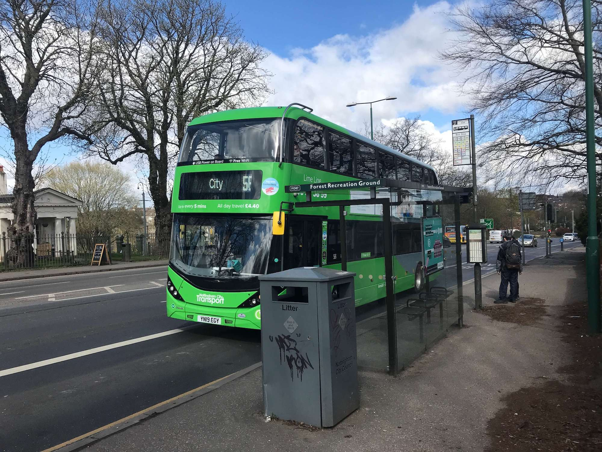

# Nottingham City Transport Bus Departures API




## Overview

TODO

## Running Locally

To run this locally, you'll need:

* [Git command line tools](https://git-scm.com/downloads) - to clone the project.
* [Node.js](https://nodejs.org/en/download/) - use the latest long term stable (LTS) version.
* Cloudflare Wrangler - a tool for developing and deploying Cloudflare Workers (requires a free [Cloudflare account](https://www.cloudflare.com/))
* A web browser, anything will do but I like [Google Chrome](https://www.google.com/chrome/).

First, get the code:

```bash
$ git clone https://github.com/simonprickett/nctx-stop-api.git
$ cd nctx-stop-api
```

Then, follow the Wrangler instructions to authenticate Wrangler with your Cloudflare account.  Now, you're ready to start a local copy of the worker:

```bash
$ wrangler dev
💁  watching "./"
👂  Listening on http://127.0.0.1:8787
```

## Deploying to Cloudflare Workers

When you're ready to publish the worker to the world and give it a public URL that's part of your Cloudflare account, use Wrangler:

```bash
$ wrangler publish
✨  Basic JavaScript project found. Skipping unnecessary build!
✨  Successfully published your script to
 https://nctx.crudworks.workers.dev
```

TODO explain the above...

## Usage

### Obtaining a Bus Stop ID

This API works  at the bus stop level, there's no endpoints to get a list of routes or stops.  To make it work you'll need a bus stop ID.  You can get one of these from the [Nottingham City Transport website](https://www.nctx.co.uk/) like so:

* Go to the Nottingham City Transport home page.
* Enter a location into the "Live Departures" search box (example locations: "Sherwood", "Gotham", "Victoria Centre"), or click "find your stop on the map".
* A map appears showing bus stops near your location - pick one and click on it.
* A pop up appears, click "Departures"
* You should now be looking at the live departure board for a stop.  The stop ID is the final part of the page URL, for example given the URL `https://www.nctx.co.uk/stops/3390J1`, the stop ID is `3390J1`.
* Make a note of your stop ID and use it in the examples below. 

### Requesting Departure Data for a Bus Stop

The following examples all use stop ID `3390FO07` ("Forest Recreation Ground"), and route numbers and line colours that pass through that stop.

All examples are `GET` requests, so you can just use a browser to try them out.  You could also use [Postman](https://www.postman.com/).  These examples assume you're running the worker code locally, just swap the URL to your production one if you've deployed it and want to run it in production.

#### Get All Departures

To get all the departures for a given stop ID go to the following URL:

```
http://localhost:8787/?stopId=3390FO07
```

This returns TODO...

```json
{
  "stopId": "3390FO07",
  "stopName": "Forest Recreation Ground",
  "departures": [
    {
      "lineColour": "#FED100",
      "line": "yellow",
      "routeNumber": "70",
      "destination": "City, Victoria Centre T3",
      "expected": "2 mins",
      "expectedMins": 2,
      "isRealTime": true
    },
    {
      "lineColour": "#935E3A",
      "line": "brown",
      "routeNumber": "16",
      "destination": "City, Victoria Centre T2",
      "expected": "3 mins",
      "expectedMins": 3,
      "isRealTime": true
    },
    {
      "lineColour": "#522398",
      "line": "purple",
      "routeNumber": "88",
      "destination": "City, Parliament St P4",
      "expected": "5 mins",
      "expectedMins": 5,
      "isRealTime": true
    },
    ...
  ]
}
```

TODO explanation

### Filtering / Limiting Data Returned

There are various ways in which you can filter and limit the data returned.  These are all specified using extra parameters on the request, and can be combined together in a single request.

TODO examples of:


### Specifying the Format for Data Returned

The worker can return data in two different formats.

#### JSON Responses

TODO

#### Delimited String Responses

TODO
